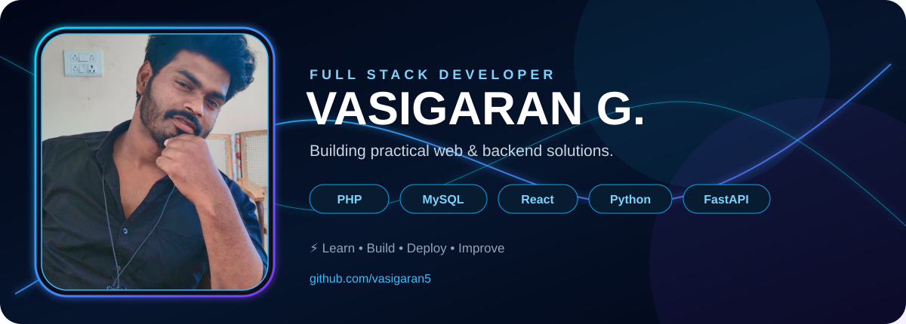

### 👨‍💻 Full Stack Developer • Backend • Web • Mobile

  
  

---

## 🧠 About Me

- 💻 Building projects with **PHP, MySQL, React, Python and FastAPI**
- 🚀 Interested in **backend development, APIs and full-stack applications**
- 📱 Exploring **Flutter** for mobile development
- 🌱 Always learning and improving through real projects

## ⚡ Tech Stack

  

## 🚀 Featured Projects

| Project | Stack | Description |
|---|---|---|
| **CRM System** | PHP • MySQL • React | Customer and management workflow project |
| **Portfolio Website** | PHP • MySQL • React | Personal portfolio with project management |
| **FastAPI Projects** | Python • FastAPI • MySQL | Backend/API learning projects |
| **Flutter Projects** | Flutter • Dart | Mobile application experiments |

> Replace the project names above with your actual repository links as you publish them.

## 📊 GitHub Activity

  

## 📈 GitHub Stats

  
  

## 🐍 Contribution Snake

  

---

### 💙 Build. Learn. Repeat.

**Let's build something useful.**

